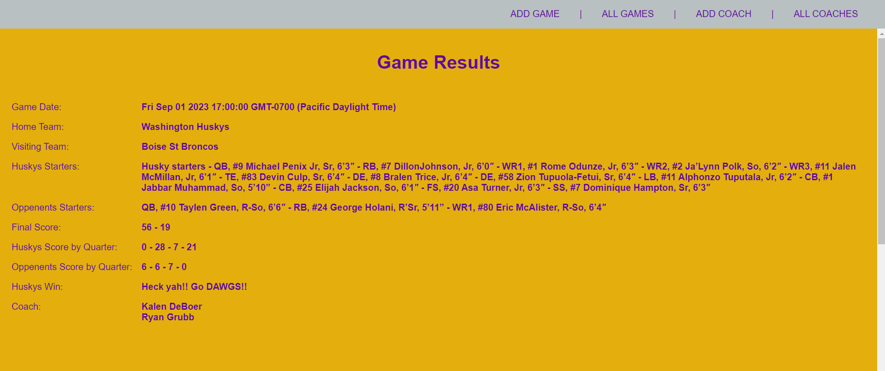
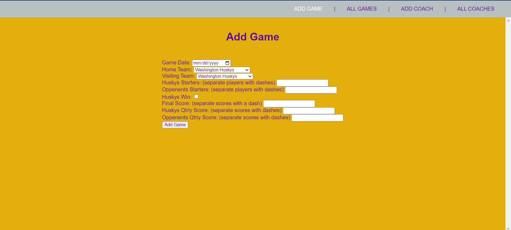

## Project 2

# Title:
HUSKY FOOTBALL TRACKER

# Discription:
Track all things Husky football with this handy app.

# Screenshots:

# Technologies Used:
Node.js |
Express.js |
Mongoose |
MongoDB |
JavaScript |
HTML |
CSS |

# Getting Started:

# Next Steps
Future enhancements include: 
-Add third party API to access all college footbal teams,   players, and coaches.
-Add CSS to make the app more modern
-Create a splash page with video clips of the Huskys